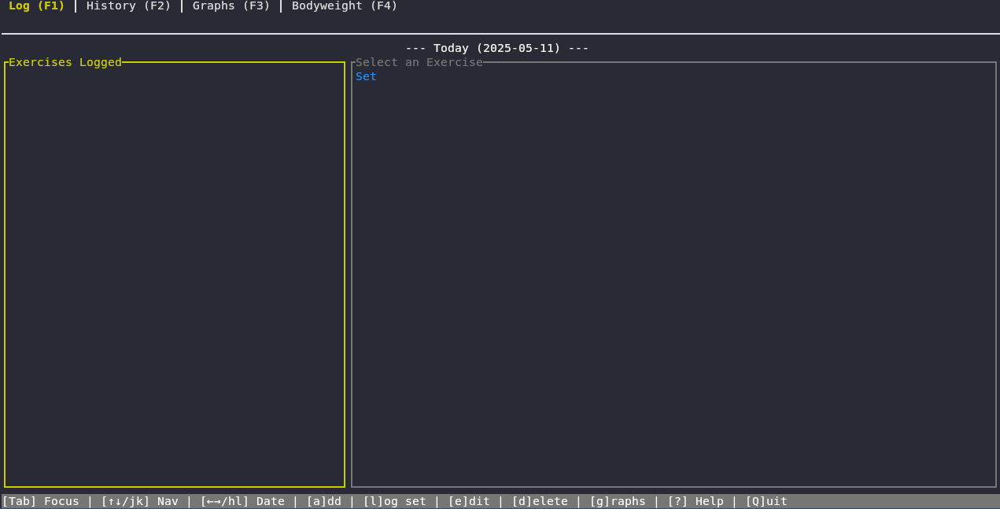
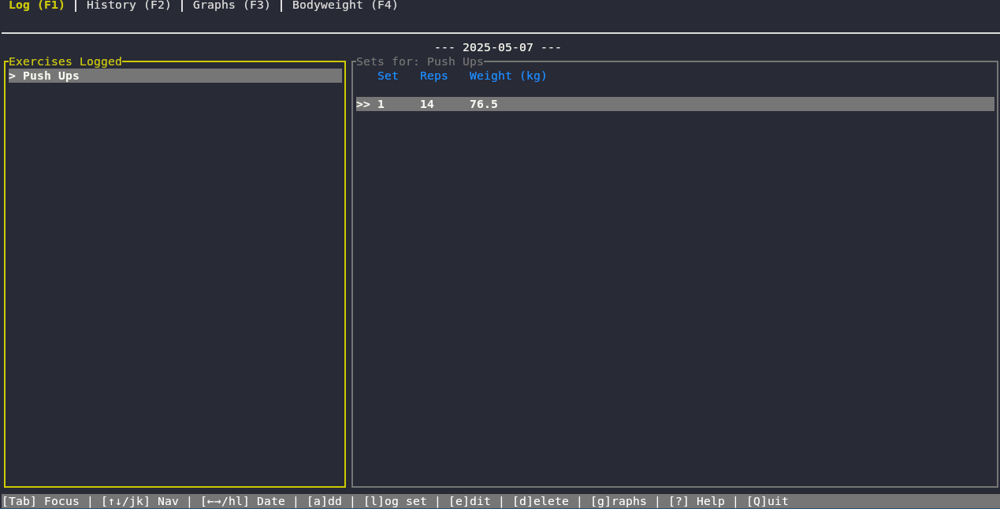
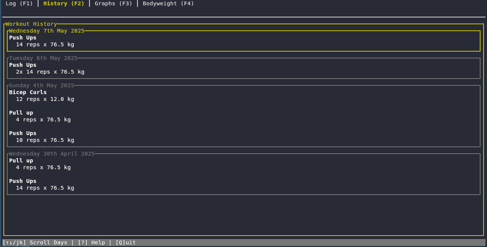
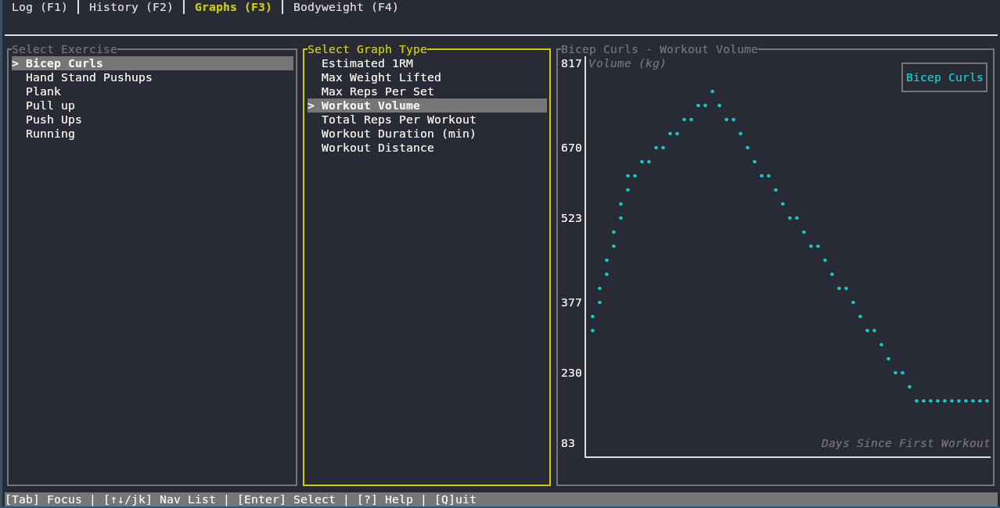
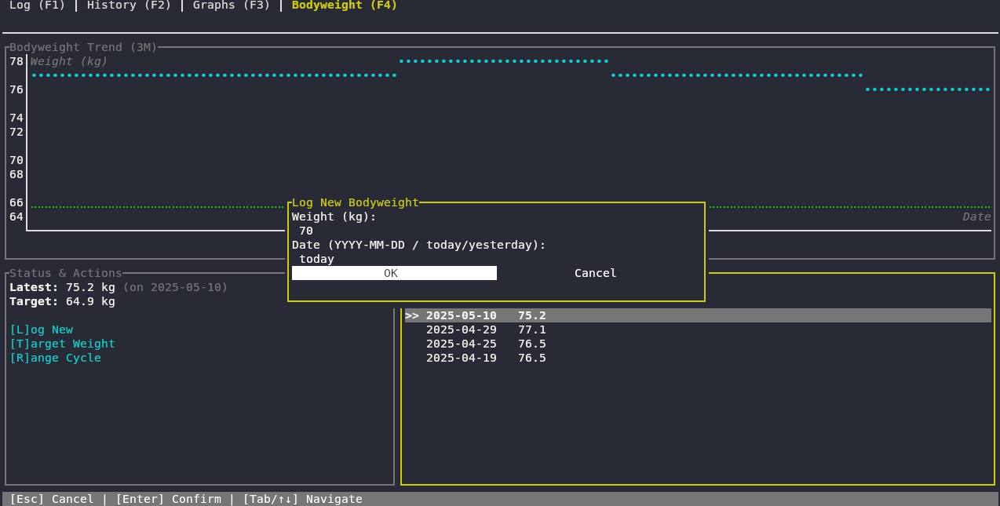

# Task Athlete TUI - Workout Tracker

Welcome to the Task Athlete TUI (Text-based User Interface)! This application provides an interactive, terminal-based way to track your workouts, exercises, bodyweight, and progress.



## Table of Contents

- [Features](#features)
- [Installation](#installation)
- [Running the TUI](#running-the-tui)
- [Global Keybindings](#global-keybindings)
- [Main Views (Tabs)](#main-views-tabs)
  - [Log Tab (F1)](#log-tab-f1)
  - [History Tab (F2)](#history-tab-f2)
  - [Graphs Tab (F3)](#graphs-tab-f3)
  - [Bodyweight Tab (F4)](#bodyweight-tab-f4)
- [Modals](#modals)
  - [Add Workout](#add-workout)
  - [Edit Workout](#edit-workout)
  - [Create Exercise](#create-exercise)
  - [Log Bodyweight](#log-bodyweight)
  - [Set Target Bodyweight](#set-target-bodyweight)
  - [Confirm Deletion](#confirm-deletion)
  - [Personal Best (PB) Notification](#personal-best-pb-notification)
  - [Help Modal](#help-modal)
- [Configuration](#configuration)
- [Contributing](#contributing)
- [License](#license)

## Features

*   **Interactive Tracking:** Log workouts, exercises, and bodyweight through an intuitive terminal interface.
*   **Tabbed Navigation:** Easily switch between different views: Log, History, Graphs, and Bodyweight.
*   **Daily Log:** View and manage workouts for specific dates, with quick navigation between days.
*   **Workout History:** Browse a comprehensive history of all your workout sessions.
*   **Visual Progress:** Track exercise performance and bodyweight changes with interactive graphs.
*   **Custom Exercises:** Define your own exercises with specific types (Resistance, Cardio, Bodyweight) and logging parameters.
*   **Bodyweight Management:** Log bodyweight entries, view trends, and set target weights.
*   **Modal Dialogs:** Dedicated pop-ups for adding, editing, and managing data.
*   **Exercise Suggestions:** Get quick suggestions when adding workouts.
*   **Personal Best Notifications:** Get notified when you achieve new PBs.
*   **Configurable Units:** Supports Metric and Imperial units (configurable via CLI or config file).

## Installation

(Instructions on how to install `ta` and its TUI component would go here. This might involve:
*   Downloading a pre-compiled binary from a releases page.
*   Using a package manager (e.g., `brew install ta`, `apt-get install ta`).
*   Building from source: `git clone <repository-url>` and then `cargo build --release` if it's a Rust project.)

**Example Placeholder:**

To install `task-athlete-tui`, please refer to the [releases page](<link-to-your-releases-page>) for pre-compiled binaries.
Alternatively, if you have [Rust installed](https://www.rust-lang.org/tools/install), you can build from source:
```bash
git clone <your-git-repository-url>
cd task-athlete # or task-athlete-tui if it's a separate crate
cargo build --release --bin ta-tui # Assuming the TUI binary is 'ta-tui'
# The executable will be in target/release/ta-tui
```

## Running the TUI

Once installed, you can typically run the TUI with a command like:

```bash
ta-tui
```
(Or `ta --tui` if it's an option of the main CLI tool)

## Global Keybindings

These keys work throughout most of the application:

*   `Q`: Quit the application.
*   `?`: Show/Hide the Help modal.
*   `F1`: Switch to the **Log Tab**.
*   `F2`: Switch to the **History Tab**.
*   `F3`: Switch to the **Graphs Tab**.
*   `F4`: Switch to the **Bodyweight Tab**.
*   `Esc`: Close the current modal or clear input in some cases.

## Main Views (Tabs)

The application is organized into several tabs for different functionalities.

### Log Tab (F1)

This tab is your primary interface for logging workouts for a specific day.



**Panes:**
*   **Exercises Logged Today (Left):** Lists unique exercises performed on the `log_viewed_date`.
*   **Sets for Selected Exercise (Right):** Displays a table of sets (reps, weight, duration, etc.) for the exercise selected in the left pane.

**Keybindings (Log Tab):**
*   **Focus on Exercise List:**
    *   `k` / `↑`: Navigate up.
    *   `j` / `↓`: Navigate down.
    *   `Tab`: Switch focus to the Sets Table.
    *   `a`: Open **Add Workout** modal for the current `log_viewed_date`.
    *   `c`: Open **Create Exercise** modal.
    *   `g`: Navigate to the **Graphs Tab** for the selected exercise.
    *   `h` / `←`: View previous day's log.
    *   `l` / `→`: View next day's log.
    *   `H`: Jump to the previous date that has any workouts logged.
    *   `L`: Jump to the next date that has any workouts logged.
*   **Focus on Sets Table:**
    *   `k` / `↑`: Navigate up.
    *   `j` / `↓`: Navigate down.
    *   `Tab`: Switch focus to the Exercise List.
    *   `e` / `Enter`: Open **Edit Workout** modal for the selected set.
    *   `d` / `Delete`: Open **Confirm Deletion** modal for the selected set.
    *   (Date navigation `h/l/H/L` also works here)

### History Tab (F2)

Browse all your past workouts, grouped by day.



**View:**
*   A scrollable list where each item represents a day you worked out.
*   Expanding a day shows the exercises and sets performed.

**Keybindings (History Tab):**
*   `k` / `↑`: Scroll up through the days.
*   `j` / `↓`: Scroll down through the days.
*   `l` / `Enter`: Jump to the **Log Tab** for the selected date in history.

### Graphs Tab (F3)

Visualize your progress for specific exercises.



**Panes:**
*   **Select Exercise (Left):** List of all defined exercises.
*   **Select Graph Type (Middle):** List of available graph types (e.g., Estimated 1RM, Max Weight).
*   **Graph Display (Right):** Shows the chart for the selected exercise and graph type.

**Keybindings (Graphs Tab):**
*   **Focus on Exercise List:**
    *   `k` / `↑`: Navigate up.
    *   `j` / `↓`: Navigate down.
    *   `Tab`: Switch focus to Graph Type List.
    *   `Enter`: Select exercise and move focus to Graph Type List.
*   **Focus on Graph Type List:**
    *   `k` / `↑`: Navigate up.
    *   `j` / `↓`: Navigate down.
    *   `Tab`: Switch focus to Exercise List.
    *   `Enter`: Select graph type and update the graph.

### Bodyweight Tab (F4)

Track your bodyweight over time, view trends, and manage your target weight.



**Sections:**
*   **Bodyweight Trend Graph:** Visualizes your bodyweight changes.
*   **Status & Actions:** Shows latest/target weight and provides actions.
*   **History Table:** Lists all your logged bodyweight entries.

**Keybindings (Bodyweight Tab):**
*   `Tab`: Cycle focus between Graph, Actions, and History Table.
*   `l`: Open **Log Bodyweight** modal.
*   `t`: Open **Set Target Bodyweight** modal.
*   `r`: Cycle graph time range (1M, 3M, 6M, 1Y, All).
*   **Focus on History Table:**
    *   `k` / `↑`: Navigate up.
    *   `j` / `↓`: Navigate down.
    *   `d` / `Delete`: Open **Confirm Deletion** modal for the selected bodyweight entry.

## Modals

Modals are pop-up dialogs used for specific actions.

**General Modal Keybindings:**
*   `Esc`: Usually cancels the action and closes the modal.
*   `Enter`: Usually confirms the action or moves to the next field.
*   `Tab` / `Shift+Tab`: Navigate between fields.
*   `↑` / `↓`: Navigate lists or increment/decrement numeric fields.

### Add Workout

*   **Purpose:** Log a new workout set for an exercise.
*   **Fields:** Exercise Name/Alias, Sets, Reps, Weight, Duration, Distance, Notes.
*   **Features:**
    *   Exercise input provides suggestions as you type.
    *   Fields are dynamically shown/hidden based on the selected exercise type.
    *   Pre-fills data from the last workout of the selected exercise.
*   **Navigation:**
    *   Exercise Input: Type to filter. `↓` to enter suggestions list.
    *   Suggestions List: `↑`/`↓` to navigate, `Enter` to select.
    *   Other fields: `Tab`/`Shift+Tab` to move. `↑`/`↓` to modify numeric inputs.

### Edit Workout

*   **Purpose:** Modify an existing workout set.
*   **Fields:** Similar to Add Workout, but the exercise name is not editable.
*   **Features:** Pre-fills with the data of the workout set being edited.

### Create Exercise

*   **Purpose:** Define a new type of exercise.
*   **Fields:** Name, Muscles (comma-separated), Type (Resistance, Cardio, Bodyweight), Log Flags (Weight, Reps, Duration, Distance).
*   **Navigation:** `Tab`/`Shift+Tab`, `Enter` to select type/toggle flags.

### Log Bodyweight

*   **Purpose:** Record your bodyweight on a specific date.
*   **Fields:** Weight, Date (YYYY-MM-DD, "today", "yesterday").

### Set Target Bodyweight

*   **Purpose:** Set or clear your target bodyweight.
*   **Fields:** Target Weight.
*   **Actions:** Set, Clear Target, Cancel.

### Confirm Deletion

*   **Purpose:** Confirm before deleting a workout set or bodyweight entry.
*   **Actions:** `Y` (Yes), `N` (No), `Enter` (Yes), `Esc` (No).

### Personal Best (PB) Notification

*   **Purpose:** Informs you when you've achieved a new personal best for an exercise (e.g., max weight, reps).
*   **Actions:** `Enter` or `Esc` to dismiss.

### Help Modal

*   **Purpose:** Displays a summary of keybindings for different parts of the application.
*   **Access:** Press `?` globally.
*   **Actions:** `Esc`, `?`, or `Enter` to close.

## Configuration

Task Athlete TUI shares its configuration with the `ta` CLI tool.
*   **Database Path:** Use `ta db-path` (CLI command) to find your data.
*   **Config Path:** Use `ta config-path` (CLI command) to find your settings.
*   **Units (Metric/Imperial):** Set using `ta set-units <Metric|Imperial>` (CLI command). The TUI will respect this setting.
*   **PB Notifications & Streak Interval:** Also configurable via CLI commands (see `ta --help`).

## Contributing

Contributions are welcome! Please open an issue or submit a pull request on the [issue tracker](https://github.com/Vilhelm-Ian/TaskAthleteTUI/issues).


## License

This project is licensed under the [MIT License](LICENSE)
```
